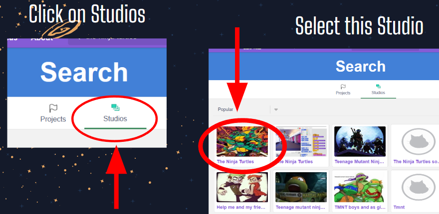

# Introduction to Programming Techniques Using a Simplified Interactive Game Development Experience 
## Description
* Difficulty Level: Beginner
* Target Audience: 6th grade - College
* Duration of Workshop: 1 hour 
* Needed Materials: Computers, Makey Makey, and conductive materials such as bananas and Play-Doh modeling compound.
* Learning outcomes: The two primary goals of this project is teaching the students the basics of Scratch and giving them a crash course on algorithms.
* Scratch is a block-based programming language developed by the MIT Media Lab as an educational tool for children. Through our classroom workshops and outreach activities, students get to learn how to program character movement and sprite animation in Scratch, using the fundamental programming concepts such as variables, if-else statements, and loops. These experiences will help them develop problem-solving and logical reasoning skills that can be applied to other programming languages as well as other fields outside of computing. Through this project, we hope to increase interest and participation in STEM; and show that learning how to program can be fun and creative.
* [TAP](https://ggc.edu/academics/school-of-science-and-technology/research-internships-service-learning/technology-ambassador-program) (Technology Ambassadors Program) is a project-based class that provides a collaborative environment for students to work with their fellow classmates on a semester-long project using technologies of their choice. TAP strives to increase participation in IT through numerous outreach activities and workshops that are designed to showcase the creative and fun side of technology.

[Commercial Video](https://github.com/TAP-GGC/NinjaTurtles/assets/157164928/94b037a6-8912-44da-8a8c-84c0b8a0afb8)

## Team
* Anh Tang
* Julissa Valdez-Ramos
* Jean Makita Mbama

## Advisor
* Dr. Cindy Robertson
* Dr. Anca Doloc-Mihu

## Team Photo

(From left to right: Anh Tang, Julissa Valdez-Ramos, Jean Makita Mbama.)  

## Publications 
1. Anh Tang, Jean Makita Mbama, Julissa Valdez-Ramos, Anca Doloc-Mihu, Cindy Robertson. "Introduction to Programming Techniques Using a Simplified Interactive Game Development Experience", STaRS Symposium, April 11, 2024, Georgia Gwinnett College.  

## Outreach Activities 
1. Tap Expo, February 29th, Georgia Gwinnett College - To promote IT field and the TAP program to college students.
2. Atlanta Science Festival, March 23. 
3. Super Saturday Series (S3), April 13, Georgia Gwinnett College - Middle school girls to promote IT and STEM career.
4. Class Workshops on April 5, April 9, April 11, and April 12, to promote IT field to non-IT college students.

## Similar Projects
* If you're interested in another project with the Makey Makey, please check out Monster Makey. 

## Technology
This project uses Scratch the Makey Makey. 

### Scratch

* [Scratch](https://scratch.mit.edu/) is a block-based programming language developed by the MIT Media Lab as an education tool for children to learn computing in a fun and interactive way.
* Scratch has drag-and-drop interfaces. Unlike working with a text-based programming language like Java or C whom you must physically type every line of code, in Scratch, you can drag and drop pre-made codes and organize them into an algorithm. It's like solving a jigsaw puzzle!
* We picked Scratch for our project because it's a fun medium to teach beginners about programming without overwhelming them with syntax. In fact, our space-themed game is entirely built in Scratch.

The code on the left and the right are doing the exact same thing.

### Makey Makey
* [Makey Makey](https://makeymakey.com/) is a tool set that lets you create a controller using conductive materials to complete the circuit. For our project, we mainly use bananas and Play-Doh, but other conductive materials such as aluminum foil and citrus will also work.
* How to use the alligator clips: 

## Project Setup/Installation 
You don't need a Scratch account to follow along with the lesson or to play the game. 
### Opening a blank Scratch page 
1. Go to the Scratch website:https://scratch.mit.edu
2. Click on Create in the top left corner of the screen.

3. A blank Scratch workspace will pop up.

### Getting to the game 
1. Go to the Scratch website:https://scratch.mit.edu
2. Using the Search bar, type in "The Ninja Turtles". Note that Scratch is very picky, so it's important to use the exact same search key.

3. Click on Studios, then select this studio as shown in the picture below.

3. Select TAP Workshop.

5. Select the full screen option, then press the green flag to start playing the game.

## Short Demo Instructions 

## Workshop Instructions 
